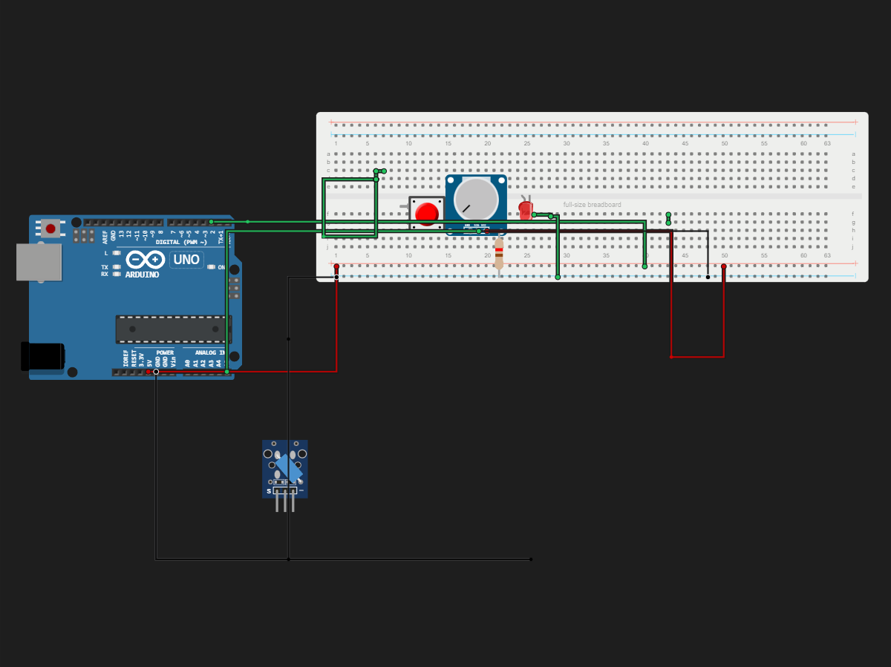

# Tutorial

> Built in [Breadboard](https://breadboard.hackclub.com), a Hack Club program. This project took ~4 hours of work.

## What It Does

An Arduino alarm that trips when a vibration switch detects movement, lighting an LED. The LED stays on until you press a button to reset it.

## How It Works

The circuit is captured in `breadboard-project.json`, and the firmware that runs it is in the `firmware/` folder.

## How To Use It

g g  fe fe

## Demo

- **Simulate it live:** [http://localhost:3000/share/18](http://localhost:3000/share/18), runs the firmware in the Breadboard simulator
- **View the design:** [https://taniwankenobi.github.io/breadboard-plays/p/18/](https://taniwankenobi.github.io/breadboard-plays/p/18/)

## Schematic

The editor snapshot is in `breadboard-project.json`.

## Bill of Materials

| Part | Quantity |
| --- | --- |
| breadboard-full | 1 |
| led-red | 1 |
| potentiometer | 1 |
| pushbutton | 1 |
| resistor-220 | 1 |
| vibration-switch | 1 |

## Firmware

Firmware files are in the `firmware/` folder.

## Build Journal

Build journal entries are kept in [`journals.md`](journals.md).

---

*Made in [Breadboard](https://breadboard.hackclub.com) — 4h of work*

